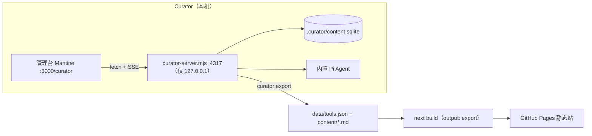

# 系统架构

本文描述当前实现。三个组成部分、一条数据流：**Curator 编辑 → SQLite → 导出 → 公开站静态消费**。

## 组成

| 部分 | 技术 | 职责 |
|------|------|------|
| 公开站（`app/[locale]/`） | Next.js 16 `output: "export"`、React 19、定制 CSS | 只读静态产物，中英双版，可部署 GitHub Pages |
| Curator 前端（`app/curator/` + `components/`） | Mantine 9 | 本地管理台：工作台、资源库、编辑器、收录、系统 |
| Curator 服务（`scripts/curator-server.mjs`） | Node 内置 `http` + `node:sqlite` | 本地 API：内容 CRUD、AI 收录、候选版本、静态导出、构建校验 |

公开站与 Curator 前端互不依赖样式：公共站是无框架定制 CSS（`app/globals.css` + `app/transitions/`），Curator 走 Mantine（主题定制 `app/curator/curator.css`）。

## 数据流



- 编辑源只有 SQLite；`data/` 与 `content/` 是**派生文件**，每次保存/发布/删除后由服务自动重新导出，也可用 `npm run curator:export` 手动触发。
- 公开站构建时通过 `lib/data.ts`（读 `data/tools.json`）与 `lib/public-content.ts`（读 `content/**/*.md` 的 JSON frontmatter + Markdown）加载内容，不做任何数据库访问。
- 服务只监听 `127.0.0.1`，CORS 只放行本站来源（`CURATOR_ALLOWED_ORIGIN` 可追加）。

## 公开站路由

| 路由 | 说明 |
|------|------|
| `/` | 重定向到 `/en/` |
| `/[locale]` | 首页：工具 / 技能 / 项目 / 提示词四个板块（客户端切换，无单独路由） |
| `/[locale]/skills/[slug]` `/projects/[slug]` `/prompts/[slug]` | 长文详情页（`generateStaticParams` 由 `content/` 驱动，无内容时保留 `__empty__` 占位路由命中 `notFound()`——`output: export` 要求动态段至少产出一个路由） |
| `/curator/**` | 管理台（CI 发布前会从 `out/` 移除） |

内容文件是 JSON frontmatter + Markdown（`lib/public-content.ts` 解析），`status !== "active"` 的文件不参与构建。

## Curator 服务 API（`http://127.0.0.1:4317`）

| 方法与路径 | 用途 |
|------|------|
| `GET /health` | 服务状态、本机 Agent 可用性、构建任务 |
| `GET /agents` | Pi Agent 可用性与网关模型列表 |
| `GET /build` `POST /build` | 查询 / 启动构建校验（`next build`，日志轮询） |
| `GET /content` | 内容分页列表（板块/状态/检索/排序/`issues=true` 问题过滤），附全量 `counts` |
| `PUT /content` `PUT /content/batch` | 保存单条（带 revision 乐观锁）/ 批量发布或归档 |
| `GET /content/:id` `DELETE /content/:id` | 读取 / 删除 |
| `POST /content/:id/reprocess` | 让 Agent 重新处理，产出候选 revision |
| `GET /content/:id/candidates` | 候选列表 |
| `POST /content/:id/candidates/:rev/apply` `…/abandon` | 应用 / 放弃候选 |
| `GET /runs` `POST /runs` | 分析任务列表 / 创建收录任务 |
| `GET /runs/:id` `GET /runs/:id/events` | 任务详情 / SSE 过程事件流（支持 `Last-Event-ID` 续传） |
| `POST /runs/:id/cancel` `…/retry` `…/save` | 取消 / 重试 / 保存草稿 |
| `GET /runs/records` `DELETE /runs/records` | 本地运行记录统计 / 清理（保留 30 份、14 天） |
| `GET /activity` | 最近写入记录（保留 120 条） |
| `GET /site` `PUT /site` | `data/site.json` 读取 / 更新 |

AI 收录管线：服务器把 `skills/curator-ingest/SKILL.md`（编辑口径与边界）+ 目标 URL + 目录快照交给内置 Pi Agent。Pi 通过受控的 `web_fetch` / `web_search` 工具取证，并用 `submit_draft` 提交符合 schema 的唯一草稿；服务器负责任务队列、SSE 进度、字段校验、同域查重、Logo 固化与导出。Agent 失败即失败（显示原因），没有备用草稿。

## 环境变量

| 变量 | 默认 | 说明 |
|------|------|------|
| `CURATOR_PORT` | `4317` | 服务端口 |
| `CURATOR_SITE_PORT` | `3000` | 公开站 dev 端口（决定 CORS 白名单与"打开公开站"链接） |
| `CURATOR_CONTENT_DB` | `.curator/content.sqlite` | 数据库路径 |
| `.curator/pi-config.json` | Curator「系统」页 | 当前项目专用的 Pi Agent 网关、密钥与默认模型；忽略提交，文件权限为 `0600` |
| `CURATOR_ALLOWED_ORIGIN` | 本站来源 | 追加允许的 CORS 来源 |
| `NEXT_PUBLIC_CURATOR_API_URL` | `http://127.0.0.1:4317` | 前端访问的服务地址 |
| `PAGES_BASE_PATH` | 未设置 | CI 注入的 GitHub Pages `basePath`（本地不设） |
| `NEXT_PUBLIC_BASE_PATH` | `""` | 由 `next.config.ts` 从上面派生，Logo 路径拼接用 |

## 部署

`.github/workflows/deploy-pages.yml`：lint → `curator:export` → 设置 `PAGES_BASE_PATH` 构建 → 移除 `out/curator/` → 上传 Pages。线上不含数据库、服务与任何 Agent 记录。

## 目录速览

```
app/[locale]/        公开站路由（定制 CSS）
app/curator/         管理台路由（Mantine，含 curator.css）
components/          公开站组件 + components/curator/ 管理台组件
lib/                 数据加载、内容模型、i18n、服务客户端
scripts/             curator-server / -dev / -db / -migrate / -export
data/  content/      派生静态产物（公开站只消费这些）
.curator/            SQLite 编辑源与运行记录（gitignore）
```
