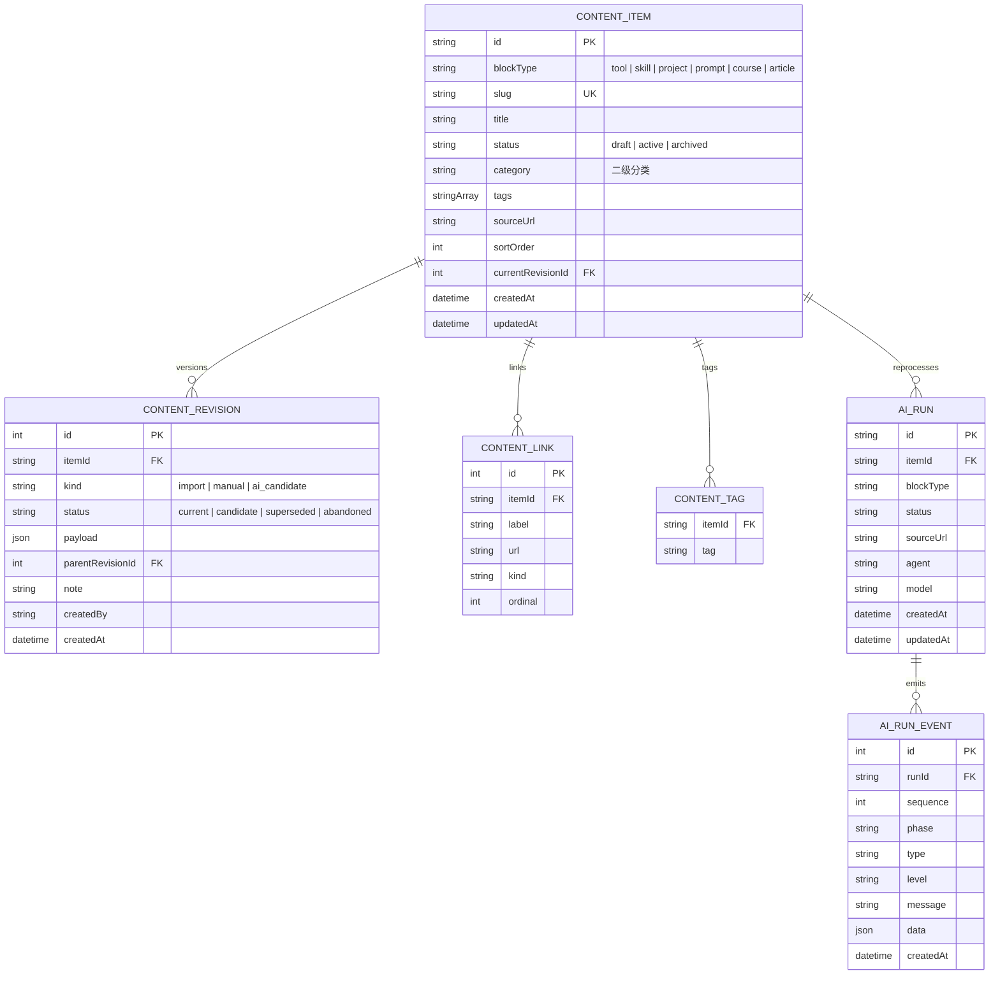

# 数据模型

Curator 的编辑源是本机 SQLite（`.curator/content.sqlite`，schema v6）；公开站只消费导出的静态 JSON/Markdown。本文是两边共享的内容契约。

## 内容板块

板块决定数据结构、编辑器和公开站产物（`lib/content-blocks.ts`）。

| 板块 | blockType | 编辑形式 | 公开站产物 | 状态 |
|------|-----------|----------|------------|------|
| 工具 | `tool` | 结构化卡片：Logo、双语 tagline/summary、官网、定价、平台 | `data/tools.json` | 启用 |
| 技能 | `skill` | Markdown 正文、双语摘要、相关链接 | `content/skills/*.md` | 启用 |
| 项目 | `project` | 同技能 | `content/projects/*.md` | 启用 |
| 提示词 | `prompt` | 提示词正文、变量、示例、相关链接 | `content/prompts/*.md` | 启用 |
| 课程 | `course` | 同技能 + 章节 | `content/courses/*.md` | 注册未启用 |
| 专题文章 | `article` | 同技能 | `content/articles/*.md` | 注册未启用 |

`ENABLED_CONTENT_BLOCK_IDS` 决定管理台与路由暴露哪些板块；新板块按注册表扩展（schema 校验 + 编辑器 + 导出目标一体定义）。

## 各板块 payload

```ts
// tool
{ logo?, tagline: Localized, summary: Localized, description?, url,
  pricing: "free"|"freemium"|"paid"|"api", platforms: Array<"web"|"app"|"api"|"cli"> }

// skill / project / article
{ summary: Localized, body: string, links: ContentLink[] }

// prompt
{ summary: Localized, prompt: string, variables: {name, description, example?}[],
  examples: {input, output}[], links: ContentLink[] }

// course = skill + level? + chapters?

// ContentLink = { label, url, kind?: "official"|"docs"|"repository"|"reference"|"other" }
// Localized = { en: string, zh: string }
```

Schema 校验（`contentSchemas`）在保存时强制执行；导出的工具条目没有双语 verdict/summary 时公开站构建直接失败（`lib/data.ts`）。

## 状态与生命周期

- `status: draft | active | archived`，只有 `active` 参与导出与构建。
- 收录保存时：工具直接 `active`，长文进 `draft`（必须补正文后才能发布）。
- 发布校验：已发布的长文必须有 `body`，已发布的提示词必须有 `prompt`。
- AI 重新处理**只生成候选 revision**，应用候选才落为当前版本；编辑器里的保存永远走人工确认。

### Revision 生命周期

```
ai_candidate (candidate) ──apply──▶ manual (current) ──下一次编辑──▶ superseded
            └──abandon──▶ abandoned
导入历史：import (current) ──▶ superseded
```

## 文案口径

- `verdict`：一句定位，中文 ≤ 16 字、英文 ≤ 8 词；`summary`：中文 ≤ 32 字、英文 ≤ 22 词（`lib/curator-issues.ts` 的 `COPY_LIMITS`，收录表单实时计数）。
- 服务端另有硬截断兜底（verdict 36/72 字符、summary 72/140 等），两套数字用途不同：前者是编辑口径，后者是存储上限。
- 中英各自独立撰写，专有名词保持原文。

## SQLite（schema v6）



说明：

- 读取默认只暴露 `current` revision；`candidate` 不进入列表（`createContentRepository`）。
- 保存带 `expectedRevisionId` 乐观锁，冲突时报「内容已在其他窗口更新」。
- 分析任务（runs）本身在内存中管理并持久化到 `.curator/runs/`（JSONL 事件 + 索引），不进 SQLite；保留 30 份、14 天。`AI_RUN/AI_RUN_EVENT` 表是早期设计的保留结构。

## 导出目标

`scripts/curator-export.mjs` 把 SQLite 写成公开站产物（服务在每次保存/发布/删除后自动调用）：

| 来源 | 目标 |
|------|------|
| `blockType = "tool"` 且 `active` | `data/tools.json`（扁平卡片结构） |
| 其余启用板块且 `active` | `content/<block>s/<slug>.md`（JSON frontmatter + 正文） |

导出会同步移除已失效的 `data/resources.json` 并清空重建各 `content/` 子目录；`data/site.json.updatedAt` 在每次写操作后更新。
